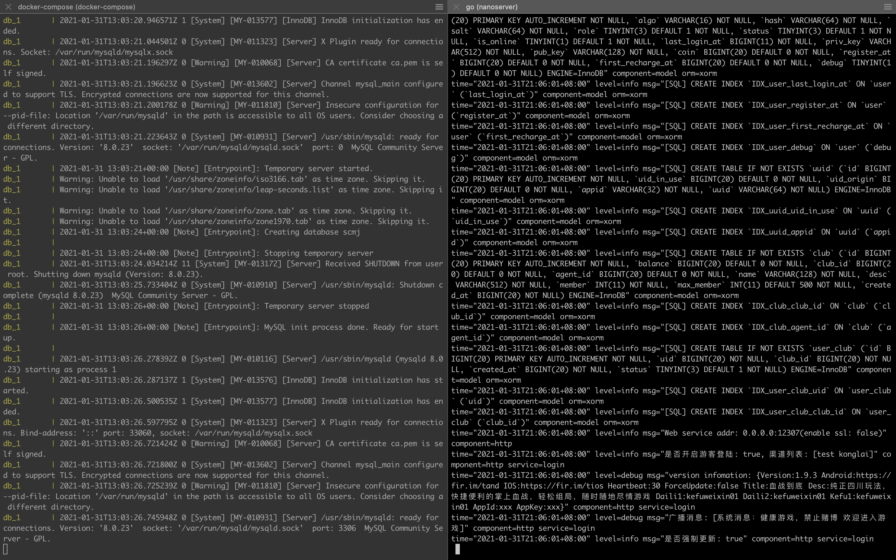

# 云原生项目实践DevOps(GitOps)+K8S+BPF+SRE，从0到1使用Golang开发生产级麻将游戏服务器—第1篇

这将是一个完整的，完全践行 `DevOps/GitOps` 与 `Kubernetes` 上云流程的 Golang 游戏服务器开发的系列教程。 

这个系列教程是对开源项目 `Nanoserver` 的完整拆解，旨在帮助大家快速上手 Golang（游戏）服务器后端开发。通过实践去理解 Golang 开发的精髓 —— `Share memory by communication(通过通信共享内存)`。

同时这个项目可能还会涉及到 `Linux` 性能调优（BPF相关的工具）和系统保障（SRE）的相关的工作。

同志们，服务器端程序是跑在 Linux 上面的。为啥性能上不来，可能真的是对操作系统了解的太少（共勉）。

之前为少写过的相关文章：
* [探索 Golang 云原生游戏服务器开发，硬核实战之调试 NanoServer 生产级麻将游戏服务器](https://mp.weixin.qq.com/s/jAj0lh57NflZQsi5cw5xMw)

## 服务端

我调整过后的项目：
* [https://github.com/Kirk-Wang/nanoserver](https://github.com/Kirk-Wang/nanoserver)

原项目
* [https://github.com/lonng/nanoserver](https://github.com/lonng/nanoserver)

我的本地环境：
```sh
go version
# go version go1.14.14 darwin/amd64
```
### 使用容器运行 MySQL & Adminer

`docker-compose.mysql.yaml`
```yaml
version: '3.1'
services:
  db:
    image: mysql
    command: 
      - --default-authentication-plugin=mysql_native_password
      - --character-set-server=utf8mb4
      - --collation-server=utf8mb4_unicode_ci
    restart: always
    networks:
      - db_network
    ports:
      - "3306:3306"
    volumes:
      - 'db_data:/bitnami/mysql/data'
    environment:
      MYSQL_DATABASE: scmj
      MYSQL_ROOT_PASSWORD: 123456
    healthcheck:
      test: ['CMD', '/opt/bitnami/scripts/mysql/healthcheck.sh']
      interval: 15s
      timeout: 5s
      retries: 6
  adminer:
    image: adminer
    restart: always
    networks:
      - db_network
    ports:
      - 8080:8080
volumes:
  db_data:
    driver: local
networks:
  db_network:
    driver: "bridge"
```

**启动**

```sh
docker-compose -f docker-compose.mysql.yaml up
# docker-compose -f docker-compose.mysql.yaml up -d 后台运行
# docker-compose -f docker-compose.mysql.yaml down 卸载
# docker-compose -f docker-compose.mysql.yaml ps

# 清理数据文件
# docker volume ls
# docker volume rm nanoserver_db_data
```

容器启动后，会自动帮我们创建数据库 - `scmj`。

### 启动服务端程序

已启动好 `MySql` 后，我运行如下命令：

```sh
go run .
```

正常你会看到如下截图（会自动的创建表和索引）：



我们可以进入 [http://localhost:8080/](http://localhost:8080/) 查看一下：


## 客户端

在 [Kirk-Wang/nanoserver](https://github.com/Kirk-Wang/nanoserver) 中，为少已经放了一份专注于调试服务器逻辑的 [apk](https://github.com/Kirk-Wang/nanoserver/blob/master/mahjong.apk)。

### 安装安卓模拟器

这里我推荐网易的 [MuMu模拟器](https://mumu.163.com/)。


### 安装 APK

[mahjong.apk](https://github.com/Kirk-Wang/nanoserver/mahjong.apk)，已经放到笔者修改过的项目中。这里我们使用多开助手，开4个空来血战。


### 客户端登录

我们点击微信登录。


发现登录失败……

如何解决？请继续阅读。

### 解决客户端登录失败问题

当然这问题，也好解决：

1. 按作者所说那样，反编译 `apk`，找到 `appConfig.luac`，使用二进制编辑器改完服务器地址，然后重新打包。


2. 直接使用代理，如 `Charles` 进行请求地址转发。（本地调试服务器程序完全够了）

### Charles 对客户端请求地址转发

使用 `Map Remote` 映射到你本机调试的地址就完全够了。


### 加入 guest 测试渠道 konglai


### 重新登录进入游戏


完美，搞定。

## 测试 & 凑一局血战到底

### 创建房间


### 加入房间


### 开始游戏


### 查看服务器日志


## DevOps(Drone CI/CD) & DevOps

### .drone.yml

```yaml
kind: pipeline
type: kubernetes
name: NanoServer

steps:

  - name: 更新 Chart.yaml appVersion
    image: busybox
    commands:
      - echo $DRONE_COMMIT
      - '[ -n "$DRONE_COMMIT" ] && (
          sed -i "s/APP_VERSION/${DRONE_COMMIT}/g" k8s/nanoserver/nanoserver/Chart.yaml;
        )'
      - cat k8s/nanoserver/nanoserver/Chart.yaml

  - name: 构建 Docker Image
    image: plugins/docker
    settings:
      debug: true
      dockerfile: Dockerfile.prod
      repo: hub.your-domain.com/library/nanoserver
      tags: ${DRONE_COMMIT}
      registry: hub.your-domain.com
      username:
        from_secret: docker_user
      password:
        from_secret: docker_pass

  - name: 上云(HelmV3) -> K8S Cluster
    image: pelotech/drone-helm3
    settings:
      helm_command: upgrade
      chart: ./k8s/nanoserver/nanoserver
      release: nanoserver
      vaules_yaml: ./k8s/nanoserver/values.yaml
      namespace: nano
      api_server:
        from_secret: api_server
      kubernetes_token:
        from_secret: k8s_token
      skip_tls_verify: true

trigger:
  branch:
    - master
```


## GitOps & ArgoCD 声明式云原生渐进式部署


```
作者：为少
微信：uuhells123
公众号：黑客下午茶
加我微信（互相学习交流），关注公众号（获取更多学习资料~）
```

